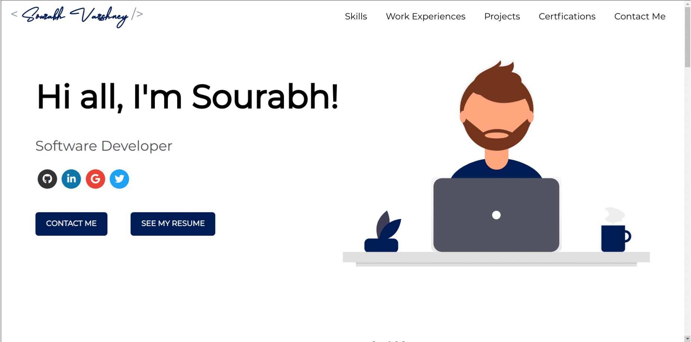

# Software Developer Portfolio ⚡️

## A simple, beautiful and responsive portfolio template for Developers!

<p align="center">
  <kbd>
    </img>
  </kbd>
</p>

Just change `src/portfolio.js` to get your personal portfolio . Feel free to use it as-is or customize it as much as you want.

## Sections

✔️ Summary and About me\
✔️ Skills\
✔️ Work Experiences\
✔️ Projects\
✔️ Certifications\
✔️ Contact me\

To view a live example, **[click here](https://developer-portfolio-6e336.web.app/)**

## Getting Started 🚀

These instructions will get you a copy of the project up and running on your local machine for development and testing purposes.

You'll need [Git](https://git-scm.com) (which comes with [npm](http://npmjs.com)) installed on your computer

```
npm@6.9.0 or higher
git@2.17.1 or higher
```

## How To Use 🔧

# Install dependencies

```
$ npm install

#Start's development server
$ npm start
```

```
#### Using Emojis

For adding emoji 😃 into the texts in `Portfolio.js`, use the `emoji()` function and pass the text you need as an argument. This would help in keeping emojis compatible across different browsers and platforms.

```
